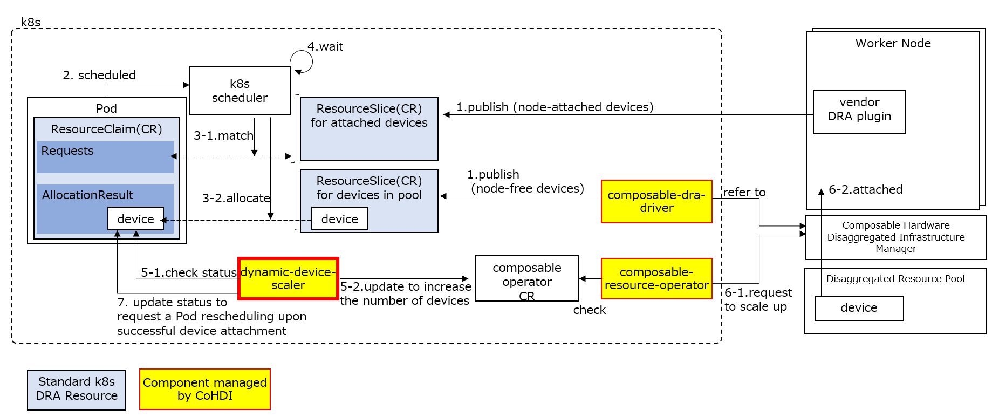

# dynamic-device-scaler

Dynamic Device Scaler and Composable DRA Driver are components that enable dynamic device scaling (adding and removing) without OS reboots, based on requests from Pods. They bridge the gap between:
- k8s' [Dynamic Resource Allocation](https://kubernetes.io/docs/concepts/scheduling-eviction/dynamic-resource-allocation/) feature
- Composable Disaggregated Infrastructure

Composable Disaggregated Infrastructure is a new architecture that centrally manages devices such as GPUs in a pool, allowing for the flexible, software-defined configuration of Composed Baremetal, which combines servers and devices as needed. Each device and server is connected to a PCIe or CXL switch, and the control of this switch enables dynamic attachment and detachment of devices.
This technology enables efficient device utilization by sharing expensive devices across multiple nodes, providing only the necessary resources when needed.

In k8s, to leverage Composable Disaggregated Infrastructure and achieve efficient device utilization, an intelligent component is required to scale devices up as needed based on workload demands, and scale them down when they are no longer required.
Dynamic Device Scaler is the solution. It works in conjunction with k8s' DRA feature and the scheduler to issue instructions for device scaling in response to device requests from Pods.

## Description

The following components work together to achieve dynamic scaling:

- **k8s Dynamic Resource Allocation**: Provides a mechanism for allocating hardware devices (e.g., GPUs) to Pods based on their requirements. 
 It defines available device listings (ResourceSlice), representing a pool of allocatable hardware resources with specific characteristics.
 Pods request resources through Device requests (ResourceClaim), specifying the desired type and quantity of hardware devices.
- **k8s Scheduler**: Schedules Pods. Considers DRA device requests and determines Pod placement. Implements the DRA feature and [KEP-5007](https://github.com/kubernetes/enhancements/tree/master/keps/sig-scheduling/5007-device-attach-before-pod-scheduled) to operate with composable devices.
- **vendor DRA plugin**: Provides a 3rd party DRA driver as a kubelet plugin, provided by device vendors. Outputs a list of devices attached to the node as a ResourceSlice. Prepares the devices for the Pod to operate.
- **Composable Resource Operator**: Receives device attach/detach instructions via CRs and instructs the Composable Disaggregated Infrastructure manager accordingly.
- **Composable Disaggregated Infrastructure manager**: Manages Composable Disaggregated Infrastructure.
- **Composable DRA Driver**: Publishes available node-free devices to Kubernetes.
- **Dynamic Device Scaler**: Instructs the CDI Operator (via CRs) to scale devices based on requests of Pods.

Dynamic scaling using Dynamic Device Scaler and Composable DRA Driver is achieved through the following process.
See also [KEP-5007](https://github.com/kubernetes/enhancements/tree/master/keps/sig-scheduling/5007-device-attach-before-pod-scheduled).

1. Composable DRA Driver initially outputs device information from the ResourcePool as a ResourceSlice. This ResourceSlice is assigned a special flag (BindingCondition).
For devices attached to the node, the device vendor's DRA driver outputs the ResourceSlice.
2. A Pod requests a device. The device request is written in a ResourceClaim.
3. The scheduler matches the ResourceSlice and ResourceClaim, and temporarily assigns a device in the ResourcePool to the Pod.
4. For ResourceSlices with a BindingCondition, the scheduler waits until the BindingCondition is met.
5. The DDS understands the above situation assigned by the scheduler and instructs the Composable Resource Operator to attach the device.
6. The Composable Resource Operator instructs the Composable Disaggregated Infrastructure manager to scale up.
7. The DDS checks the device attachment status, and if it recognizes that the device is attached, it informs the scheduler (reschedule instruction).

After this point, the Pod is scheduled in the same way as traditional DRA with devices attached to the node.
